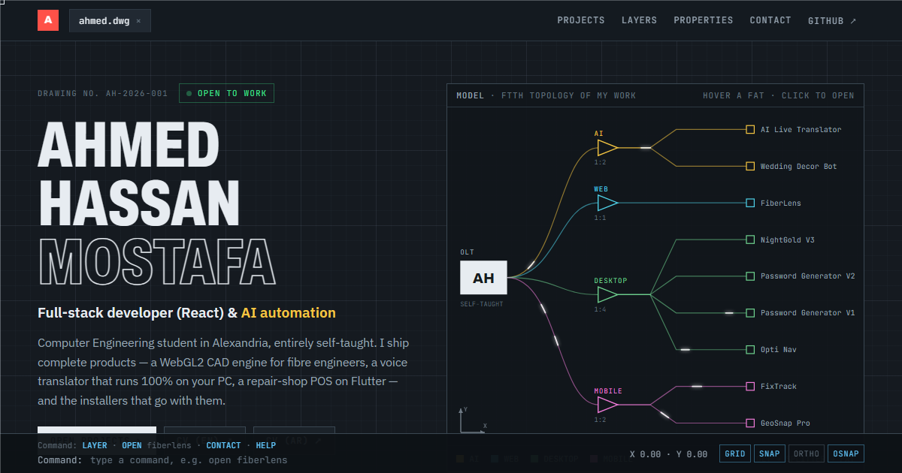

# ahmed.dwg

**The portfolio of Ahmed Hassan Mostafa, drawn as a CAD file.**

[**ahshika.github.io**](https://ahshika.github.io) · [CV (EN)](https://ahshika.github.io/cv/Ahmed-Hassan-CV-EN.pdf) · [CV (AR)](https://ahshika.github.io/cv/Ahmed-Hassan-CV-AR.pdf)

## The idea

My strongest work is CAD and fibre-network software, so the portfolio is a drawing:

- **I am the OLT.** My four skill layers (AI, Web, Desktop, Mobile) are **splitters**, and every project on my GitHub is a **FAT terminal** on the network, with light pulses running along the fibres.
- **AutoCAD-style crosshair** with live X/Y coordinates in the status bar.
- **Projects are blocks.** Hovering one shows blue selection grips and a dimension line with the project's real code size on GitHub.
- **Layers filter the projects**, just like turning CAD layers on and off.
- **A working command line**: type `open fiberlens`, `layer ai`, `contact` or `help`.

Every page element has a hover animation, and the layout adapts from a 320 px phone up to a 2560 px monitor.

## Inside

| File | What it is |
|---|---|
| `index.html` | The whole site: one file of HTML, CSS and vanilla JavaScript, no build step |
| `cv/` | My CV as PDF, in English and Arabic |
| `og.png` | Link-preview image for LinkedIn and other sites |
| `cv-src/` | HTML sources of the CV, used to render the PDFs |
| `tools/update_cv.py` + `.github/workflows/update-cv.yml` | Daily job that adds new public repos to the CV and re-renders the PDFs |

## Stays up to date by itself

- **Portfolio:** on every visit the page asks the GitHub API for my public repos. Any repo not already in the list becomes a new block and a new node on the network, built from the repo's description, language and topics.
- **CV:** a GitHub Action runs every day at 06:00 UTC. It adds new repos to both the English and Arabic CV, re-renders the PDFs with headless Chrome and publishes them. It can also be run by hand from the **Actions** tab.

Fonts come from Google Fonts (Archivo, IBM Plex Sans, JetBrains Mono). Everything else is hand-written, without frameworks.

## Contact

**Ahmed Hassan Mostafa** · Full-stack developer (React) & AI automation · Alexandria, Egypt
[ahmedhassanshika655@gmail.com](mailto:ahmedhassanshika655@gmail.com) · [LinkedIn](https://www.linkedin.com/in/ah-shika-3098623ba/) · [GitHub](https://github.com/Ahshika)
